# Pet-Project-Caso-de-usos-
# Enlace diagram https://drive.google.com/file/d/1wng6EGrHg6GHCMFiIN4usC1wxYBYj639/view?usp=sharing

# Pantallazos creacion casos de uso Manuel Monroy
Trabajo en el package que tiene el agregado Cliente
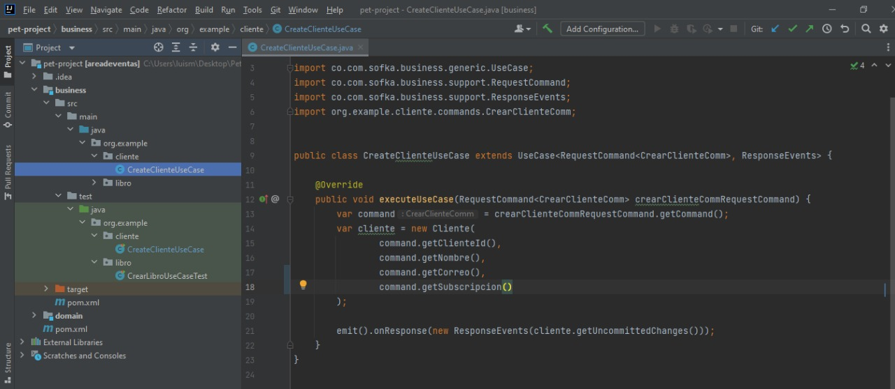
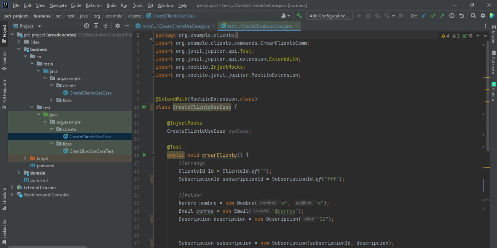
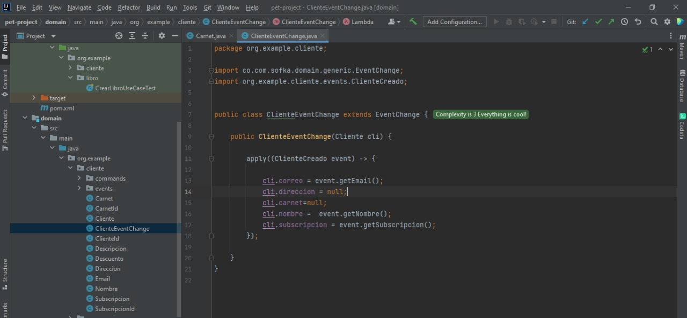
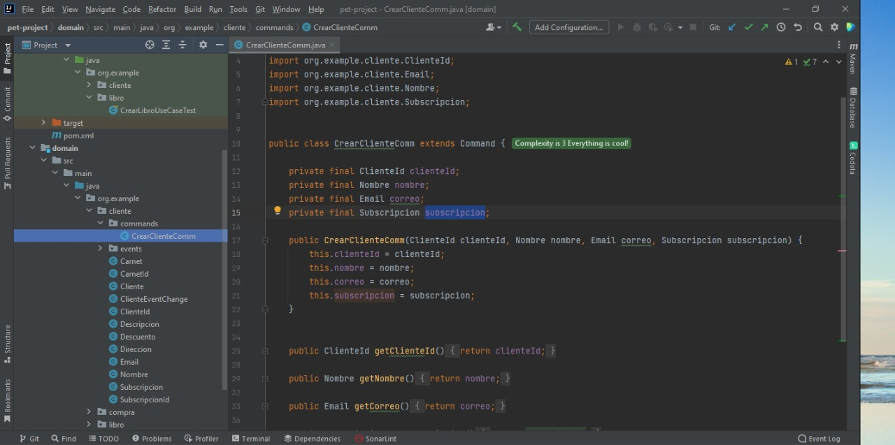
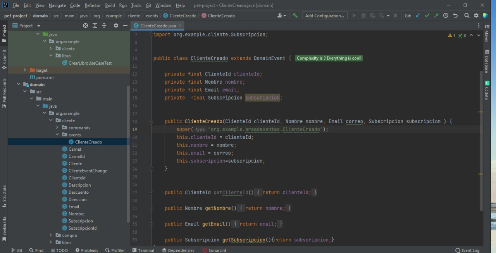

# Pantallazos Juan Rivera 
Trabajo en el package que tiene el agregado Libro
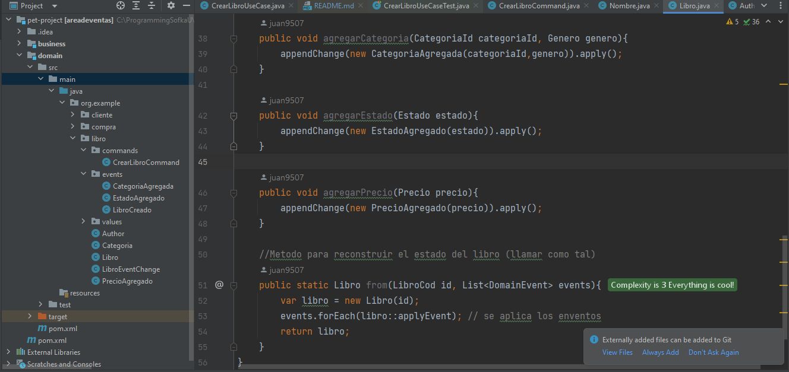
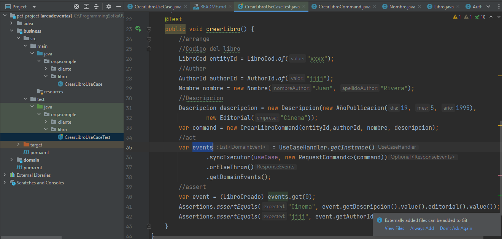
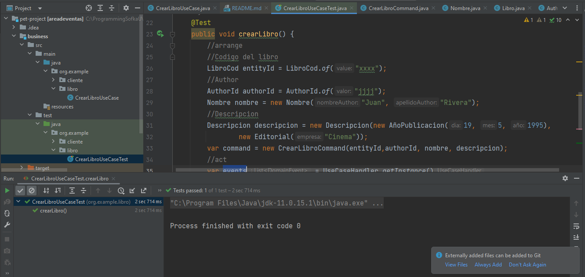
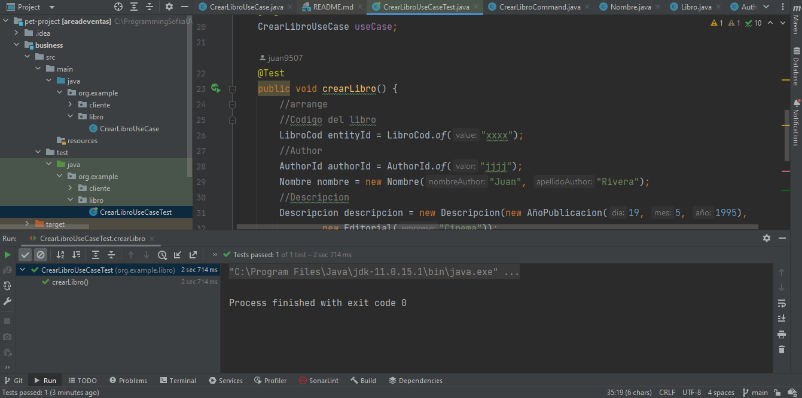

# Pantallazos Erick Diaz
Trabajo en el package que tiene el agregado Compra
trabajo en rama ErickDiaz
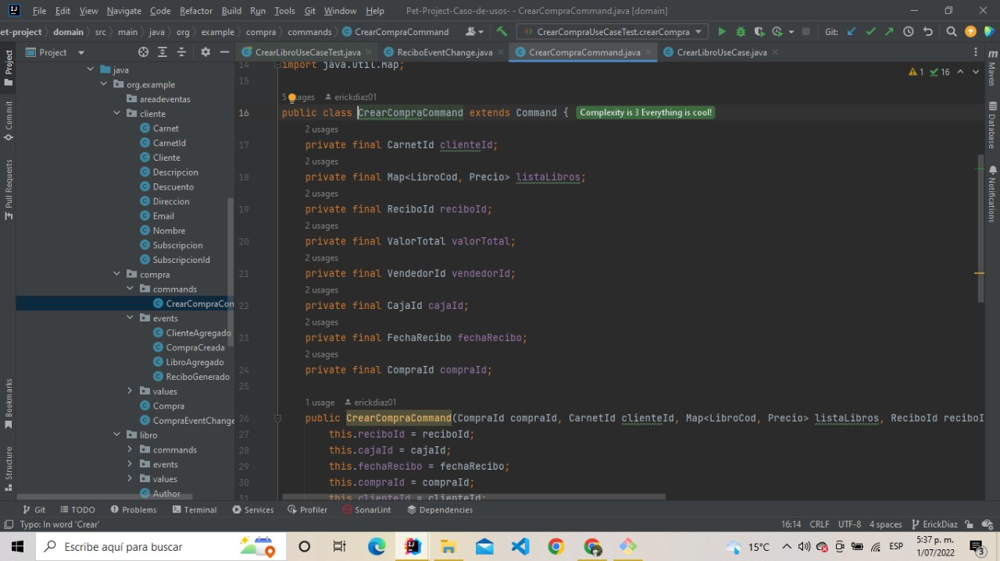
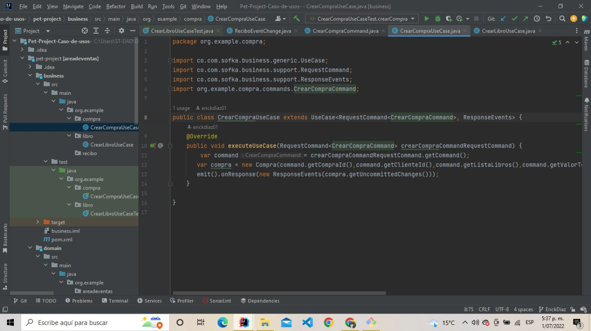